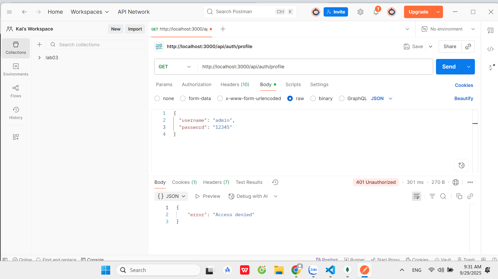
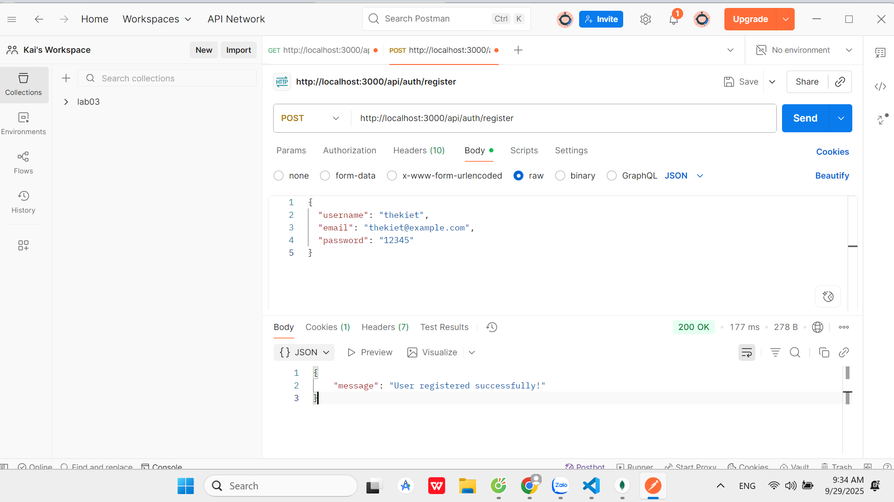
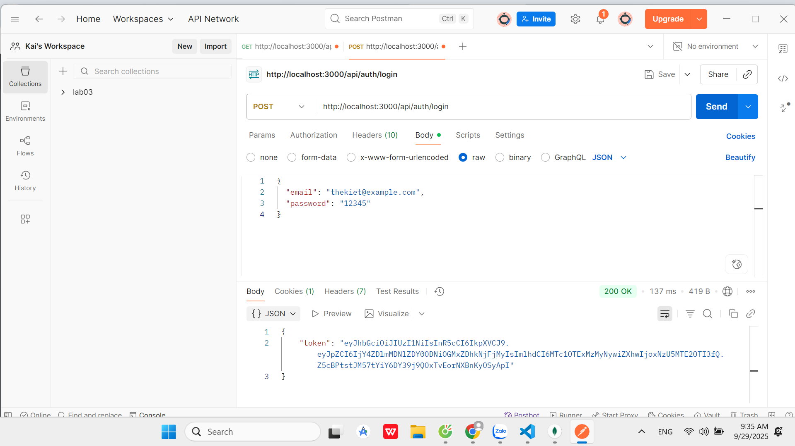
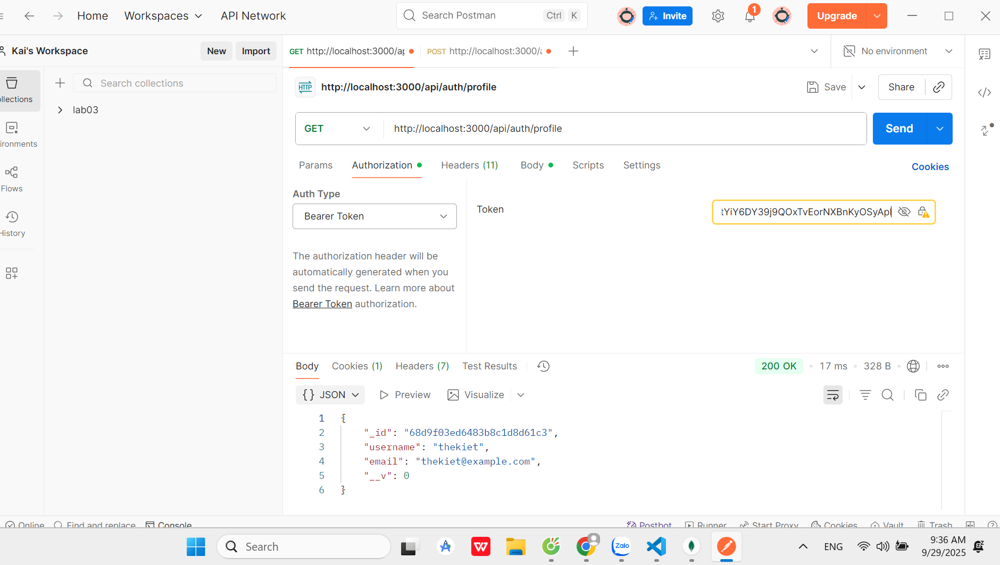

# Test token_auth

1. Go to profile  
GET http://localhost:3000/api/auth/profile  

2. Register  
POST http://localhost:3000/api/auth/register  
Body
{
  "username": "thekiet",
  "email": "thekiet@example.com",
  "password": "12345"
}  

3. Login  
POST http://localhost:3000/api/auth/login  
Body
{
  "email": "thekiet@example.com",
  "password": "12345"
}  

4. Go to profile with token  
GET http://localhost:3000/api/auth/profile  
Headers: Authorization: Bearer <token>  

